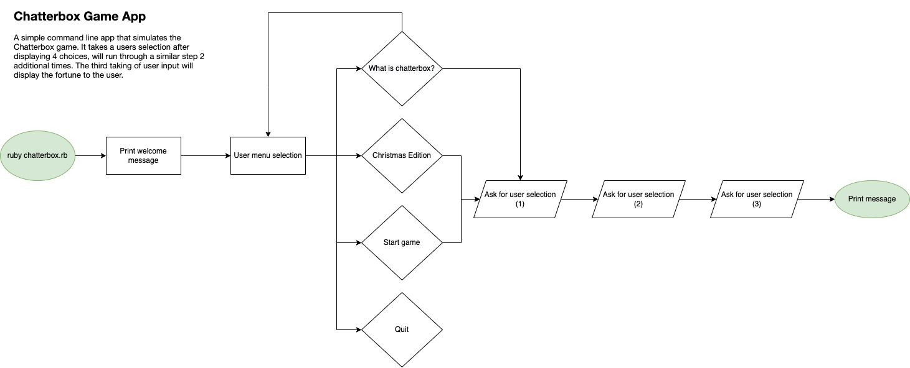

# Chatterbox Game Application

The Chatterbox app is a simple command line game that simulates the traditional Chatterbox game. The game currently has a Standard and Christmas edition, which provide a fortune and a Christmas joke respectively, based on user input.

A link to the repository in GitHub can be located [here](https://github.com/jacode77/terminal-application.git).

### Purpose and scope of the your application

#### What does the application do

Chatterbox is a terminal game that is inspired from the original game, played by school kids before the computer age set in. Originally played as an origami style game, it has been restored to stir up former memories from school days. Adding a little humour to the users day.

In the game, the user will be provided a choice to play the standard game, the Christmas edition, read further to understand what is Chatterbox or to exit. To play the standard game the user will be prompted to select one of four colours. Since the simulation of the pinching and pulling of origami paper cannot be implemented in the terminal, each letter of the colour will be printed.

A choice of 4 numbers will then be provided to the user to select from. These numbers are provided at random to ensure the final outcome remains random. Once the user selects a number, it will be counted from 1 to the number selected. The user will again be prompted to pick a number, however this time will be presented with a fortune.

The Christmas edition will run through a similar process, however will be Christmas themed. The user will first be prompted to select a Christmas character, whereby the character letters will be counted through. The same process of selecting numbers will be prompted to the user, with the last option providing the user with a Christmas joke.

#### What problem will it solve

As the app is a game, it aims to entertain the user. Bringing a bit of enjoyment and maybe a laugh. As it is a game it is not designed to solve any problems. The game has been developed primarily to help develop the creators skills with Ruby by practically applying the material covered. The chatterbox game was selected from a wave of memories from former days at school.

#### Target audience

As the game is a terminal app, the target audience would most likely be suited to a developer who is looking for a break between coding. Alternatively, it could also be a source of inspiration for a new developer looking to see what you can build with a terminal app as well as some features to make it more user friendly and interactive. Children could also enjoy the game, however would need assistance to access and use the terminal.

#### Explain how a member of the target audience will use it

After opening the file and installing the relevant gems, the user would follow the prompts to play by either selecting the Standard Edition or the Christmas Edition. The game is interactive throughout and immediately starts by asking the user for their selection. At the end of the game the game will loop back to the main menu to allow the user to play again or quit.

The app takes user input through the use of a menu and confirms this as output throughout.

### Features

The game includes the following features:

- **Use of Menus** - The use of menus simplifies the way the user interacts with the game creating an overall smoother user experience. The menus have been created through the use of the _TTY-prompt_ gem. It is a select menu that allows the user to make a selection, which in turn reduces the amount of text, particularly if the user just wants to play the game and errors.

- **User Input & Output** - Throughout the game the user is prompted for input through the use of the multi-select menu option, also using _TTY-prompt_. This feature is different to the welcome menu in that each selection is each linked to the code. The user choice is confirmed by displaying the output and continues the game based on their input. The overall *fortune* is the output based onthe overall user input.

- **Use of Coloured Text** - A standard terminal will normally display in black and white. As the game cannot simulate the actions of the actual game, and to be more engaging, the _Colorize_ gem has been implemented as a feature to display the user colour choice. For example, if the user selects _Magenta_ as their colour choice, the output is confirmed as the colour selected and spelt out in this same colour. The use of *Lolize* has also been implemented to print the fortune output.

- **ASCII Art** - As the terminal is reasonably limited in how it displays things visually, and in order to help make the game more engaging and interesting, the use of ASCII art has been implemented as a form of graphical content. While there are a few ways to display graphical content in the terminal, the use of ASCII art is fitting as it is also reasonably old school.

### User Interaction & Experience

#### How to find out how to interact with each feature:

- In order to interact with the menus, the user will be prompted to make a choice in order to advance through the game.
- Input will always be prompted through the use of *TTY-Prompt*
- The use of coloured text aims more as a visual aid and to reinforce the choice of the user when selecting a colour (or name). The user will see the choice they made prints out in a corresponding colour.
- The use of ASCII art is implemented in a number of locations throughout the game to add as something visually different and indicate where in the game the user is. As it is art, the user can simply enjoy the art or better grasp where they are in the game with the headings.

#### How to interact with each feature

- The use of the menus takes the user input for each level of the game they need to make a selection and provides confirmation of their choice as output.
- User input will always be prompted through the use of *TTY-Prompt* and provides confirmation of their choice as output. The final choice in the game prints the fortune as output.
- To interact with the coloured text, the user will need to choose a colour (or name) to see the choice they made displayed in the corresponding colour. The final number choice will display the fortune in rainbow text.
- Due to the nature of art, the user does not interact with this feature. It is for visual reference/stimulation.

#### How errors will be handled by the application and displayed to the user

### App Diagram

The following diagram shows the workflow of the app

### Implementation Plan

### Help Documentation

### References

Anne-Marie, 2019, "A Centuries Olf Favourite: The Chatterbox", Kids WantU, Viewed 16 December 2021, <https://kidswantu.com/2019/09/24/centuries-old-favourite-chatterbox/>

ASCII Art Website, nd, Viewed 16 December 2021, <https://asciiart.website/index.php?art=holiday/christmas/santa>